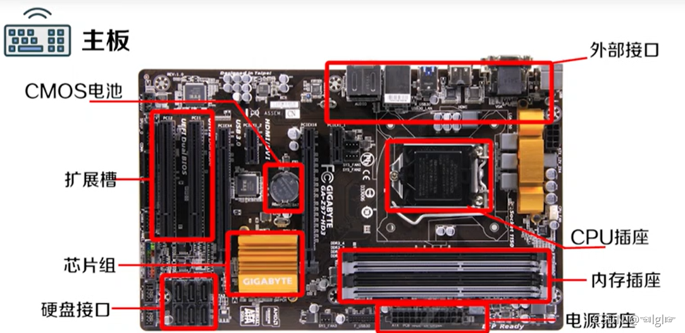
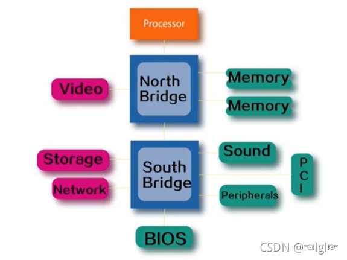

# 计算机系统导论笔记

## 01-计算机系统基础

==01==计算机系统由三部分组成：``硬件系统``、`软件系统`和`网络系统`。
==02==主机内部：

| 电源        |        供电设备，将220V交流电转换成计算机可使用的电压        |
| :---------- | :----------------------------------------------------------: |
| 微处理器CPU |         **解释并执行计算机指令，执行算术和逻辑运算**         |
| 扩展槽      | 扩展槽是主板上用于**固定扩展卡**并**将其连接到系统总线**的插槽，是**计算机与外设之间的内部接口** |
| 扩展卡      | 扩展卡是直接插在主板扩展槽上的集成电路板，**外设通过扩展卡与计算机相连**，扩展卡可**增强计算机性能和功能** |
| 主板        | **CPU、内存等设备的载体**，**接收电脑电源并分配**，**提供计算机与外设相连的接口** |
| 磁盘驱动器  | 就是硬盘，计算机中的**大容量存储媒介**，**可存储数据及程序** |
| 线缆        | 即IDE线，硬盘数据线**连接硬盘和主板**，并**负责计算机和硬件之间的数据交换** |

==03==主板上两个重要部件：`CPU`和`内存`。
==04==计算机的四个基本操作：`输入数据`、`处理数据`、`存储数据`和`输出数据`。
==05==计算机分类：

+ Personal computers 个人计算机
+ Server 服务器 / Mainframes 主机或大型机
+ Supercomputers 超级计算机
+ Embedded Computers 嵌入式计算机

==06==世界上第一台电子计算机于1946年在美国研制成功——`ENIAC(埃尼阿克)`。其不足之处：耗电量惊人、存储容量小、使用的仍是十进制、外插型、使用的是真空管容易损毁且耗电高。
==07==`晶体管`优点：体积小、价格便宜、性能稳定、耗电量低。
==08==1960s出现了`Integrated Circuits(IC，集成电路)`。
==09==1970s出现`Microprocessor(微处理器)`。
==10==使用十六进制表示法的目的：

+ 缩短编码长度。
+ 计算机的内存地址是十六进制编址。

==11==`ASCII码`：ASCII(American Standard Code for Information Interchange，美国信息交换标准代码)是基于拉丁字母的一套电脑编码系统。

## 02-计算机硬件

==01==主板：

==02==`BIOS`：Basic Input Output System，管理整个计算机的IO配置信息。
==03==``芯片组``是主板上除CPU外最重要的芯片，一般分为南桥和北桥。
==04==`北桥`负责CPU和内存之间的数据交换，同时负责与显卡的数据交换。北桥普遍被集成到了CPU中，一般不可见。
==05==`南桥`的主要作用是控制各种外围设备。
==06==北桥和南桥：

==07==`总线`是CPU、内存、输入、输出设备传递信息的公用通道，内部各部件通过总线连接在一起。
==08==外部设备通过接口电路与总线相连接。
==09==总线一般划分为三类：

+ `数据总线`：传输数据。
+ `地址总线`：用于寻址。
+ `控制总线`：控制各个部分的时序。

==10==除以上的三类总线之外，还有一条位于**CPU和北桥芯片组之间**的总线，叫：`FSB`(Front Side Bus，前端总线)。

==11==CPU的主要功能：

+ 解释指令
+ 执行基本指令
+ 处理数据计算

==12==CPU的两个基本单元：

+ `Control Unit 控制单元`：主要作用是引导和协调计算机的相关操作，起到控制作用。
+ `Arithmetic Logic Unit 算术逻辑单元`：主要用于执行算术运算和逻辑计算。

==13==`时钟周期`是计算机当中最基本的时间单位。
==14==在一个时钟周期内，CPU只完成**一个基本的动作**。
==15==CPU周期四步操作：

+ `Fetch 取指令`：把程序的指令或者数据调入到内存中。
+ `Decode 指令译码`：由控制单元把程序的内容或者指令内容翻译成命令。
+ `Execute 执行指令`：由ALU来执行相应的指令，完成相应的运算。
+ `Store 数据存储`：把运算的结果写回到内存当中。

==16==指令集分为：`精简指令集(RISC)`和`复杂指令集(CISC)`。
==17==CPU性能的重要指标是：`频率`。**频率越快，CPU处理数据的速度就越快！**
==18==**由于CPU与主板控制芯片的频率变得不同**，因此，将CPU的时钟频率叫做`主频`，而将外围设备，也就是主板频率称为`外频`。除此之外，还有`前端总线频率`(FSB Frequency)，**其介于外频与CPU的频率之间**。
==19==早期FSB频率与外频相等，但后来FSB频率变得更快！
==20==**CPU的时钟频率(CPU Clock)=外频(External Clock)×倍频的系数(Multiplier Factor)**。
==21==FSB的频率等于外频的一倍、两倍、四倍或者八倍。
==22==倍频的系数是锁定的，那么外频则可以在主板的BIOS设置中进行修改。
==23==`超频`：外频超过规定值。
==24==CPU的频率不能单独决定CPU的速度。因为CPU的型号也能决定CPU的速度，因此只有同系列的CPU比较时钟频率才有意义。
==25==继承电路上可容纳的晶体管数量，每18个月便会增长一倍，同时它的性能也会增加一倍。
==26==衡量CPU性能的单位：`IPS`(Instructions Per Second，每秒执行的指令数)或`MIPS`(Million Instructions Per Second，每秒执行的百万条指令数)。
==27==`CD`：Compact Disk，光盘。
==28==`DVD`：Digital Video Disk，数字视屏光盘。
==29==`显卡`：主要作用是从CPU上面取得需要显示的信号，然后把它显示到显示器上面，或者其他一些屏幕上。
==30==`HDMI`：高清晰多媒体接口。
==31==计算机硬件系统由`系统单元`和`外设`组成。
==32==`字长`主要由**数据总线的宽度**决定。

## 03-数字媒体

==01==`采样率(Sampling Rate)`：将模拟声音波形转换为数字时，每秒钟所抽取声波幅度样本的次数，单位是`Hz(赫兹)`。
==02==采样率提高一倍，单声道声音数据增大一倍。
==03==`量化(Quantization)`：对图像上**每个采样点的灰度值**进行**离散化**的过程。
==04==`量化数据位数(量化级)`：是指每个采样点能够表示的数据范围，经常采用的有8位、12位和16位。
==05==8位量化级表示每个采样点可以表示2的8次方(256)个不同量化。
==06==每个声道**单独**采样和量化。
==07==`单声道`：记录声音时，每次生成一个声道数据。
==08==`双声道(立体声)`：记录声音时，每次生成两个声道数据。
==09==**数字音频的存储量=采样频率(Hz)×量化位数(bit)×时长(s)÷8**，如果是双声道的话，存储容量**再增加一倍**。
==10==`像素(pixel)`：图像的最小单位，是阵列中用来描述构成图像的各个点。
==11==图像也被称为`位图(bit-map)`或者`点阵图`。
==12==`分辨率`：数字化图像的大小，即该图像的水平与垂直方向的像素个数。
==13==`图像深度`(也称`图像灰度`、`颜色深度`)：表示数字位图图像中每个像素上**用于表示颜色的二进制数字位数**。
==14==**图像可表示的颜色总数=图像深度的二的次方。**
==15==**图像数据量大小(MB)=像素总数×图像深度×通道数÷8**。
==16==`无损压缩`：去除了冗余信息，且可以还原。
==17==`有损压缩`：去除人类难以感知的细节，不可还原。
==18==**图像格式**：

+ `Bmp(Bit map)`：一般为**不压缩**。
+ `Raw`：**不压缩**，单通道12位。
+ `Jpg/jpeg`：**有损压缩**。

==19==图像的`压缩比`：压缩前与压缩后图像大小的比值。
==20==`图形(Graphic)`：计算机绘制的画面。
==21==`矢量图(Vectorgraphic)`：包含了重建图片的指令，包括绘制对象的形状、尺寸、位置、颜色等指令，这些对象均可修改。
==22==`光栅化(Rasterization)`：将顶点数据转换为片元的过程，将矢量图形转换为一个个栅格组成的图像，特点是**每个元素对应帧缓存中的一个像素**。
==23==**矢量图形可以通过光栅化转换为图像**，转换时，需要指定分辨率，转换后不能恢复。
==24==完整的视频文件是由音频流与视频流两部分组成的。
==25==**视频文件大小(MB)=(音频编码率(Kbit)÷8＋视频编码率(Kbit)÷8)×影片总时长(s)。**
==26==`采样`：将空间中的**连续图像**转换成**离散点集合**的操作。

==27==**图像和图形的区别：**

+ `图像`：**三维到二维**，是对**真实**场景的反应，用**栅格**方式表示。
+ `图形`：**二维到三维**，**假的**，人工绘制的，是一组**指令的集合**，刻画绘制对象的形状、尺寸、位置、颜色等信息。

==28==`二值图`和`灰度图`对应的量化位数分别是：**1位**，**8位**。
==29==一幅分辨率为1920×1080的256色三通道图像，未压缩，其大小为：1920×1080×8×3/8=6MB。
==30==某视屏文件音频码率为128Kbps，视屏码率为800Kbps，则100分钟该影片的容量为：(128+800)×(100×60)÷8=679.69GB。

## 04-计算机软件系统

==01==`计算机程序`是指挥计算机怎样执行任务的指令，是一个指令的集合。

==02==软件分类：

+ `系统软件`：为计算机服务，处理以计算机为中心的任务。
+ `开发软件`：为程序员服务，帮助完成开发软件的任务。
+ `应用软件`：为用户服务，帮助用户完成某一实际的任务。

==03==`系统软件`包括：`操作系统`、`设备驱动程序`和`实用程序`。

>  ==04==`设备驱动程序`如网卡、声卡、打印机等中的内部程序，**是外设与计算机之间通信的桥梁**。
>  ==05==`实用程序`如文件管理、安全、备份、网络管理、系统监控等软件。

==06==`开发软件`包括：编程语言、脚本语言和质量保证工具。

==07==`商用软件`：

+ `纵向市场软件`：完成**特定市场或企业中专门的任务的软件**，如学校的学生管理软件或医院的记账软件。
+ `横向市场软件`：**几乎任何企业都能使用的通用软件**，如薪金软件、会计软件和项目管理软件等。

==08==`软件许可证`规定了计算机程序使用方式的法律合同。
==09==`定点许可证`：**统一定价**的并**允许特定区域内的所有计算机使用**软件。
==10==`并行用户许可证`：**按照副本的数量来定价**的，**允许一定数量的副本同时使用**。
==11==`拆封许可证`：分发介质通常会**封装在封套、塑料盒或塑料薄膜收缩包装中**。打开包装，拆封许可证就开始生效。
==12==`最终用户许可证`：在初次安装软件时显示在屏幕上，用户只有点击接受许可条款，才能继续安装软件。
==13==按照法律的观点，软件可分为两类：

+ `共域软件`：不受版权保护，可免费复制、发行甚至转卖。
+ `专有软件`：在版权、专利或许可证协议中描述使用限制。

==14==**最早的图形化操作系统**是：**Mac OS**。
==15==`Chrome OS`被视为`瘦客户端`，因为它依赖于在**远程Web服务器上运行程序**。
==16==操作系统按使用环境可分为三类：

+ `桌面操作系统`，如`Windows`和`Mac`。
+ `移动操作系统`，如`IOS`和`Android`。
+ `服务器操作系统`，如`Linux`/`Unix`、`Windows Server`和`OS X Server`。

==17==和`进程`相比，`线程`非常节省计算机资源。
==18==`多核处理器`可以将任务**平均分配给所有处理单元**。
==19==`用户界面`是指用来帮助用户与计算机相互通信的软件和硬件的结合。
==20==Mac OS操作系统将文件分成**数据部分**和**资源部分**，限制了数据的共享。
==21==Linux是开源的操作系统，`Andriod`构建在Linux内核之上。
==22==Linux**开源且安全可靠**，但需要很多修补和升级，并且应用软件很多都是面向企业和专业用户的。
==23==IOS操作系统从Mac OS X核心演变而来，IOS不包括文件管理器。
==24==**文件命名规范**

|     区分大小写     |                             否                              |
| :----------------: | :---------------------------------------------------------: |
|   文件名最大长度   |            文件名、路径和扩展名不能超过255个字符            |
|      允许空格      |                             是                              |
|      允许数字      |                             是                              |
|  不允许出现的字符  |                      * \ : < > \|" / ?                      |
| 不允许使用的文件名 | Aux、Com1、Com2、Com3、Com4、Con、Lpt1、Lpt2、Lpt3、Pm、Nul |

==25==Mac机不使用驱动器名，每个存储设备具有自己的名称(主硬盘名为：Macintosh HD)。
==26==碎片整理实用程序会重新排列文件，使它们存储在相邻的簇里。
==27==`系统软件`是用于处理以计算机为中心的任务的一类软件。
==28==`应用软件`可以协助用户执行诸如创建文档、编辑图形和定位附近餐馆之类的任务。
==29==`纵向市场软件`可用于自动完成专门的商业任务，比如医院计费。
==30==`系统实用软件`可帮助用户追踪和修复磁盘错误、修复损坏的文件和改善设备性能。
==31==`设备驱动程序`是用来协助外设与计算机建立通信的。

32、文字处理应用提供了包括页边距、行距和对齐方式在内的(==**文档**==)样式选项。
33、(==**电子表格**==)软件对执行假设分析很有用。
34、Excel中输入公式时，用户可以使用相对引用和(==**绝对引用**==)。
35、在使用数据库软件时，用户可以通过输入关键词或自然语言(==**查询**==)来查找数据。
36、每条数据库(==**记录**==)都是由很多(==**字段**==)组成。
37、大多数(==**web**==\)应用都不需要安装并且是通过浏览器访问的。
38、(==**安装程序**==)会引导用户完成安装过程。
39、下载的软件的所有文件通常都会(==**压缩**==)成一个压缩文件。
40、(==**便携式**==)软件是指一组用于修复问题和填补安全漏洞的补丁。
41、在购买软件之前，应该检查(==**系统**==)需求。
42、(==**版权**==)法律允许用户在不破坏复制机制的前提下为软件制作额外的副本或制作备份副本。
43、(==**并行用户**==)使用许可证是按每份副本定价的，并允许同时使用指定数量的副本。
44、在经过一段时间后会自动过期的(==**试用软件**==)通常是新计算机出厂商预装的。
45、LibreOffice、Firefox和Linux都属于可以合法修改和重新分发的(开源)软件。
46、单元格的(==**绝对引用**==)是指总是在指定位置引用单元格。
47、单元格的(==**相对引用**==)是基于包含公式和单元格引用的单元格的相对位置的。
48、PowerPoint的几种视图：`普通视图`、`大纲视图`、`幻灯片视图`、`幻灯片浏览视图`、`幻灯片放映视图`。
49、操作系统可以管理计算机的(==**资源**==)，例如，RAM、存储器和外设。
50、多数个人计算机操作系统都具有(==**多任务**==)功能，从而使它们能同时运行两个或多个任务、作业或程序。
51、操作系统的核心称为操作系统的(==**内核**==)。
52、现在大多数计算机都使用了(==**图形**==)用户界面。
53、在(==**引导**==)过程中，存储在ROM中的程序会指挥硬盘把操作系统加载到RAM中。
54、VMware和Parallels Desktop这样的(==**虚拟机**==)技术可用于在Mac机上运行Windows软件。
55、开源操作系统(==**Linux**==)是包括Android OS在内的若干手持设备操作系统的基础。
56、(==**资源部分**==)是指有Mac OS创建、存储文件以及与其数据相关信息的配套文件。
57、Android OS和IOS都是用于手持设备的操作系统。
58、在使用Windows时，不能使用Aux这样的(==**保留字**==)作为文件名。
59、磁盘(==**分区**==)是硬盘驱动器上被当做独立存储单元的区域。
60、除非特别指定，否则应用软件会自动将文件存储为它的(==**原生**==)文件格式。
61、文件柜或树隐喻这样的(==**逻辑**==)文件存储模型有助于用户形象地认识计算机文件的组织。
62、windows7提供了预配置的“文档”(==**库**==)，用于存放指向文件夹中文档文件的链接。
63、硬盘将数据存储在名为(==**磁道**==)的同心圆上，而它们会被分成楔形的(==**扇区**==)。
64、NTFS、HFS+和MFT这些缩写都是与(==**物理**==)文件存储模型相关的。
65、操作系统是一种系统软件：

+ 是计算机系统中发生的所有活动的总控制器。
+ 提供了运行软件和控制外设的环境。
+ 通过与应用软件、设备驱动程序和硬件的交互来管理计算机资源。

66、操作系统文件管理：

+ 物理上通过文件系统和索引文件来管理。
+ 逻辑上表现为通过文件路径来寻址。

67、操作系统使用文件系统来记录存储介质上的文件的名称和位置
68、磁盘驱动器通常以(==**簇**==)的形式进行处理。
69、簇由多个(==**扇区**==)组成。
70、扇区数与磁盘的容量和文件系统有关。
71、索引文件是文件系统维护簇的列表。
72、目录：操作系统为每个磁盘、CD、DVD、蓝光光盘或U盘维护着一个称为目录的文件列表。
73、`根目录(主目录)`：驱动器名加反斜杠，如：“C:”。
74、子目录：在Windows、Mac OS或Linux中，叫做文件夹。
75、文件的位置由文件规范(==**路径**==)定义，在PC机上包括驱动器名、文件夹、文件名和扩展名。
76、什么是索引文件？为什么操作系统要使用索引文件？

+ 答：文件有逻辑存储和物理存储两种形式，文件的物理存储是以簇的形式存放到磁盘中的，一个文件可能存放在不连续的簇中。索引文件是为了在逻辑记录和物理记录之间建立映射，在进行文件查找时，可以先通过查找索引文件找到对应文件所在的簇，就可以知道文件对应的物理地址。

==77==`集成电路(Integrated Circuit，缩写为IC)`：由微电路元件构成，包括`线缆`，`三极管`，`电阻`，`电容`等，封装在一个薄的硅片上。
==78==`晶体管`：用于替换计算机系统中的真空管。
==79==GPU上有**处理器**和**内存**等部件。
==80==`DVD`、`CD-ROM`、`CD-RW`是使用**光(激光)技术**存取数据的存储介质。
==81==计算机硬件系统由`系统单元`和`外设`组成。
==82==`BIOS`、`操作系统`、`安装文件`或`设备驱动程序`是可直接在CPU执行的程序或指令。
==83==设备驱动程序是指用来在`外设`与`计算机`之间建立通信的软件。
84、Excel中`一行与一列相交`构成一个单元格。
85、Word可同时编辑`多个`文档。
86、共享软件是指在“`购买前试用`”的方针下销售的具有版权的软件，通常是全功能软件。
87、MAC OS操作系统的特点：`易用性强`、`可靠性好`、`安全性好`、`可支持英特尔处理器`。
88、在Windows中，是根据文件的扩展名来建立应用程序与文件的关联的。
89、最早的图形化操作系统是：`MAC OS`。
90、Chrome OS被称为瘦客户端是因为`它依赖于在远程Web服务器上运行程序`。

------------

## 05-计算机网络系统一

01、信道是信号传输的物理通道或者无线传输的频段。
02、信道由物理介质构成，信号由电磁波或脉冲的形式在信道中传播。
03、常见的信道有：光纤、双绞线和同轴电缆。
04、在导向介质中，信号沿介质前行，如光纤等；而在非导向介质中，信号在空气中传播，如无线频段。
05、带宽：信道的传输能力，即信道中数据的最大传输速度。数字信道带宽的单位是bps(bits per second)；对于模拟信道而言，带宽的单位由Hz表示。
06、高带宽的通信系统被称之为宽带，如DSL和有线电视接入等。
07、低带宽的通信系统被称为窄带，如拨号上网。
08、上行速度3Mbps，下行速度25Mbps以上的通信系统被定义为宽带。
09、网络接口卡(网卡)= 发送器＋接收器。
10、网卡负责将计算机接入到网络中，可集成在主板上或插入主板插槽或通过USB外接。
11、假设一个网络中有N台通信实体，这N个实体要采用点到点直接通信，则需要N(N-1)/2条链路。
12、交换方式：线路交换和分组交换。
13、线路交换：进行数据通信时，在数据传输期间，源节点与目标节点之间存在一条由中转节点构成的专用物理线路。
14、线路交换的三个过程：线路建立、数据传输和线路拆除。
15、线路交换的通信实时性强，适用于交互式通信。但线路交换时会预分配带宽，对突发性通信不适应，系统效率低。
16、在分组交换中，数据分组成若干小块并发送到网络上，来自不同数据消息的分组可共用同一物理线路。
17、分组交换更有利于处理突发性通信。
18、由于分组交换中不存在一条端到端的物理线路，所以每个分组必须携带目标地址的信息，供中间节点(路由器)决定如何转发这个分组。路由器能生成一个路由表，当收到一个分组后，路由器根据路由表决定如何转发分组。
19、路由器作为最重要的网络设备，负责不同网络的计算机间数据的交换。
20、交换机负责同一网络不同网段之间的数据交换。
21、网络协议是指网络中数据传输的规则，定义了数据传输的格式、数据传输的顺序和数据传输过程中对数据的操作。
22、协议栈：同一网络中使用的协议的集合。
23、按照网络的规模和覆盖范围可将网络分为：

个域网：网络覆盖范围在10m以内，如蓝牙、ZigBee等。
局域网：网络覆盖范围在同一建筑内(一般在200m内)，如以太网和WiFi等。
城域网：网络覆盖范围在80km以内，进行语音和数据传输的高速公用网络，如本地ISP的网络。
广域网：网络覆盖区域广大，多由多个网络组成，如教育网。
24、因特网并非由某一公司或政府所拥有和运维。
25、因特网主干网：由高性能路由器和高速光纤链路组成，负责将各个地区连接在一起的高速网络，各个部分由不同的网络服务提供商维护。
26、因特网服务提供商(ISP)：指向个人、企业和较小的ISPs提供接入的公司。
27、ISP负责运维DNS服务器。
28、Internet是如何组织起来的：Internet被称为网络的网络，由十多个NSP(也称一级ISP)，以及数以十万计的下界ISP组成。一台计算机通过Internet向另一台计算机发送数据时，首先将数据传递给自己的本地ISP，接着本地ISP的路由器根据算法将数据转发给自己的上级ISP，各级ISP不断转发数据，直至转发到目标计算机的本地ISP，最后目标计算机的本地ISP将数据投递给目标计算机。
29、TCP传输控制协议负责将原始待传送的数据(消息或文件)分成数据段(segment)。
30、IP协议负责对分组(各种数据段)添加上地址，以便能使其路由到其目的地。
31、在Internet中要进行数据传输必须进行路由，因此网络中每台计算机和每个路由器的网络接口必须要有一个唯一标识的地址。
32、网络中计算机的地址被称为IP地址。
33、IP地址：IPv4地址32位，IPv6地址128位。
34、子网：同一子网内部所有节点的网络接口直接连通。
35、处于同一子网的计算机间数据直接传输；处于不同子网的计算机间数据由路由器转发。
36、IP地址分为两段：

网络部分(高位)：用于标识节点所属的子网
主机部分(低位)
37、子网掩码：确定IP地址中网络号长度，有32位，用1标识IP地址的网络部分，0标识IP地址的主机部分。
38、子网号的获取：IP地址&子网掩码=网络号。
39、节点发送数据分组时，将分组的目标IP地址和节点自身的IP地址分别与子网掩码做按位与操作，如果结果相同，则直接进行数据传输，如果结果不同，则说明目标与自己处于不同子网，那么将数据分组发送给默认路由器。
40、计算机要接入Internet必须获取自己的：IP地址、子网掩码和默认路由器地址。
41、往返延迟：将数据从A点传输到B点，然后再传回到A点所花费的时间。
42、可通过ping命令和tracert命令来测量自己接入Internet的连接。
43、ping命令可以检测网络是否连通和两台计算机间的往返延迟，可以很好地帮助我们分析和判定网络故障。
44、ping命令工作原理：向目标主机发送一个数据分组，再要求对方返回一个同样大小的数据分组，从而来确定两台网络机器是否连接相通，往返延时是多少。
45、TTL(Time To Live)：当分组每经过路由器转发一次，TTL会被减1。
46、Tracert用于确定IP数据包访问目标所采取的路径。
47、Tracert工作原理：利用数据分组的生存时间(TTL)字段和错误消息来确定从一个主机到网络上其他主机的路由。
48、路径上的每个路由器在转发数据包之前至少将数据分组上的TTL减1。数据分组上的TTL减为0时，路由器抛弃该分组并将错误消息发回源主机。源主机通过错误信息可以获取丢失数据分组的路由器的IP地址和往返延迟。
49、上行速度：用户计算机向因特网上传数据的速度。
50、下行速度：用户计算机从因特网下载数据的速度。
51、对称因特网连接：上行速度=下行速度，如以太网技术。
52、非对称因特网连接：上行速度≠下行速度，如ADSL技术。
53、固定因特网接入：接入的网络计算机是固定的台式机，接入技术不支持终端的移动性。
54、广泛使用的基于有线电话网络的接入技术包括拨号连接和数字用户线路DSL。
55、拨号连接是第一种通过有线电话网络接入因特网的技术，基本思想是使用语音频带调制解调器和电话线在用户计算机和其ISP之间进行数据传输的固定因特网连接。
56、语音频带调制解调器能将计算机发出的信号转换成能在电话线上传输的音频模拟信号。这些信号通过有线电话网络传递给ISP，ISP将这些信号还原成网络信号传递到Internet。
57、计算机从网络上下载数据时，ISP将网络信号转换为音频信号，通过电话网络传递到用户的调制解调器，调制解调器将其转换为数字信号传递给计算机。
58、拨号连接技术的主要问题：使用音频信号数据传输速度非常慢，只有44Kbps，并且会占用了电话线路的音频传输频带，造成上网的同时不能打电话。
59、DSL技术是对拨号连接技术的改进，是一种高速的，数字化使用标准电话系统的因特网接入技术。通过将数据信号调制到与语音信号不同的频带上，允许语音信号和数据信号同时进行传输。
60、ADSL(Asymmetric DSL，非对称DSL)；SDSL(Symmetric DSL，对称DSL)；HDSL(Hight-Rate DSL，高速DSL)。
61、像宿舍里这种覆盖有限区域的网络就是(个域网)。
62、网络中的各连接点被称为网络(节点)。
63、像TCP/IP这样的通信(协议)为编码和解码数据、引导数据到达其目的地和减弱噪声的影响设定了标准。
64、(电路/线路)交换网络会在两个设备之间建立专用链接，而(包/分组)交换网络可将消息分成小的包并基于“先到先服务”的原则进行处理。
65、IP地址可由ISP或系统管理者分配，或是从(DHCP)服务器自动获得。
66、(TCP/IP)是用于因特网的主协议组。
67、(域)名服务器维护的数据库包含了与www.nike.com这样的地址相对应的IP地址。
68、多数ISP提供的是(非对称)因特网连接，且下行速度要比上行速度快。
69、网络带宽(bandwidth)：网络带宽是指在单位时间内能传递的最大数据量，强调网络最大的数据传输速率，即传输数据率理论峰值。
70、网络吞吐量(throughput)：强调网络实际的数据传输速率。
71、通信协议：通信协议是指双方实体完成通信或服务所必须遵循的规则和约定。
72、IP地址：IP地址是IP协议提供的一种地址格式，它为互联网上的每个网络和每台主机分配一个逻辑地址，以此来屏蔽物理地址的差异。
73、域名：域名是由一串用点分隔的名字组成的Internet上某一台计算机或计算机组的名称，方便人们记忆，用于在数据传输时标识计算机的位置。
74、子网掩码是用来指明一个IP地址的哪些位标识的是主机所在的子网，以及哪些位标识的是主机的位掩码。子网掩码不能单独存在，它必须结合IP地址一起使用，表示前n位是子网地址，后面是本机的地址。子网掩码只有一个作用，就是将某个IP地址划分成网络地址和主机地址两部分。子网掩码的二进制表示由1与0组成，且1必须全部在0的左边。
75、(分组交换)是Internet主要采用的交换技术。
76、DNS系统的作用是(把域名转换为IP地址)
77、在手动配置计算机的IP地址时，必须输入(计算机的IP地址)、(子网掩码)和(默认网关的IP地址)。
78、网络中的各连接点被称为网络节点。
79、像TCP/IP这样的通信协议为编码和解码数据、引导数据到达其目的地和减弱噪声的影响设定了标准。
80、IP地址可由ISP或系统管理员分配，或是从(DHCP)服务器自动获得。
81、TCP/IP是用于因特网的主协议组。

## 06-计算机网络系统二
01、有线网络的优缺点：

优点：连接速度快；安全；容易配置；有线连接比无线连接更安全，因为数据通过电缆传输。
缺点：不支持移动性。
02、以太网是被定义为IEEE802.3标准的有线网络技术，特点是：同时将数据包向所有的网络设备进行广播，但只有被寻址的设备才能接收包。
03、以太网端口(Ethernet port)。
04、适配器(Adapter)。
05、无线网络：指不通过电缆或电线，将数据从一个设备传输到另一个设备。
06、根据无线载波频率的不同可以将无线网络分为：射频信号、无线电信号、微波和红外线。
07、无线网络的优缺点：

优点：部署方便，能够支持移动性。
缺点：比有线网络慢，存在安全性问题。
08、蓝牙：一种可在两个设备间建立连接的短距离无线网络技术。
09、WiFi两种工作方式：无线点对点协议和无线集中控制协议。
10、无线集中控制协议：网络中的数据通过接入点来进行转发。
11、安装一个局域网步骤：

1、插上路由器。
2、将路由器链接到计算机。
3、配置路由器。
4、访问路由器安装实用程序。
5、设置新的路由器密码。
6、为网络输入SSID。
7、激活WEP、WPA或PSK，并创建加密密钥。
8、连接因特网接入设备。
9、安装无线设备。
12、局域网端口也称内网端口(LAN口)。
13、选择路由器时，选择的路由器内网端口数量要大于有线连接设备的数量，否则剩余没有连上内网端口的设备需要通过集线器或者交换机再接入路由器。
14、外网端口(WAN口)：负责连接接入Internet的table或者ADSL(调制解调器)或者直接连接ISP提供的局域网。
15、路由器与有线设备之间通过双绞线进行连接。
16、将路由器配置成作为DHCP服务器，它会自动为连接到网络中的各工作站分配地址。
17、服务区标识符(Service Set Identifier，SSID)：服务区标识就是无线网络的名字。
18、在无线网络重叠的区域，SSID可以帮助用户登录正确的网络。
19、Web(World Wide Web，万维网)：通过HTTP协议在因特网上连接和访问的文档、图像、视屏和声音文件的集合。
20、网页：一个或多个基于Web的文件按照类似于书页的格式显示出来的结果或输出。
21、网站：包含一系列经过组织和格式化的相关信息，用户能使用浏览器访问这些信息。
22、在网络应用中，不同计算机上的应用程序间信息的交互采用服务器和客户端的工作模式。一个应用程序发送请求，另一个应用程序响应请求并提供某种服务。发送请求的程序被称为客户端程序，响应请求的程序被称为服务器程序。运行着客户端程序的计算机被称为客户端主机，运行着服务器程序的计算机被称为服务器主机。
23、“这个服务器的IP地址是128.0.0.1”中的“服务器”指的是一台计算机，而“路由器配置中可以打开路由器上的DHCP服务器”中的“服务器”指的是对应的程序。
24、URL(Uniform Resource Locator，统一资源定位符)：每个网页都有一个唯一地址称为URL，多数URL都是用“http://”开头，以表明使用了Web的标准通信协议。
25、HTML(HyperText Transfer Protocol，超文本标记语言)：HTML是指创建HTML文档需要遵循的一组规范，这些文档可以在浏览器中显示为网页。
26、标记语言：创建者可以通过插入特定的指令来标记文档的不同内容。
27、HTML标签(HTML tags)：用来说明浏览器如何显示文档<标签>文档内容</标签>。
28、Web如何基于HTTP协议进行工作：

1、在浏览器地址栏中输入待访问的URL。
2、浏览器和URL中指定的服务器建立连接。
3、浏览器生成一个HTTP请求发送给Web服务器。
4、服务器返回请求的HTML文件。
5、完成发送后Web服务器关闭自己与浏览器之间的连接。
29、Cookie(HTTP Cookie)：由Web服务器生成后存储在用户计算机硬盘上的文本文件中的一小块数据。
30、HTTP是一种无状态(stateless)协议，每一次用户连接到不同的页面时，服务器都会认为这是一次新的访问，它不会记录用户在网站中浏览过的页面，Cookie能解决这一问题。
31、Cookie使服务器能够记录用户的行为。
32、HTML脚本是一系列程序指令，可以直接嵌入到HTML文档的文本或由HTML文档引用的文件中，指示浏览器执行特定的动作或响应特定的用户动作。
33、HTML脚本根据执行的主机可分为：

服务器端脚本：运行在服务器上，接收表单提交的数据，处理数据，生成定制的HTML文档。
客户端脚本：由浏览器执行。
34、仅有IE支持VBScript。
35、Web是基于(HTTP)协议工作的。
36、URL唯一标识了网络中的一个(网页)。
37、有线电视因特网服务的两个必要条件是处理以太网协议的电路和电缆调制解调器。
38、WEP、WPA和PSK都属于(无线)加密技术。
39、用于收发Web内容的主协议是HTTP。
40、移动因特网接入可以定义为行走或驾乘车辆时使用因特网的能力。
41、Wi-Fi热点是指公众可以接入提供因特网服务的Wi-Fi网络的区域。
42、WAP设备已经被使用移动宽带/网络技术、能够提供完整因特网体验的设备所替代。
43、便携式(卫星)技术可用于没有有线电视、WIMAX或蜂窝网络的偏远区域接入因特网。
44、WiFi是当今最流行的无线局域网接入技术。
45、为了灵活使用有线和无线连接，可以选用具有千兆以太网交换机功能的无线路由器。
46、要在停电的时候还能为网络设备供电，就需要将路由器连接到UPS上。
47、SSID是给无线网络提供的名称。
48、用于Web的基础标记语言是HTML。
49、因为HTTP是一种无状态协议，使得每次连接到不同网页时Web服务器都会把它当做一次新连接，所以cookie技术被开发出来。
50、(3)G技术包括EV-DO、HSUPA和EDGE。
51、WAP(Wireless Application Protocol，无线应用协议)：是一项全球性的网络通信协议。WAP使移动Internet有了一个通行的标准，其目标是将Internet的丰富信息及先进的业务引入到移动电话无线终端之中。WAP定义了可通用的平台，把目前Internet网上HTML语言的信息转换成用WML(Wireless Markup Language)描述的信息，显示在移动电话的显示屏上。WAP只要求移动电话和WAP代理服务器的支持，而不要求现有的移动通信网络协议做任何的改动，因而可以广泛地应用于GSM、CDMA、TDMA、3G等多种网络。

## 07-计算机网络系统三
01、Web搜索引擎：通过形成简单的关键字查询来帮助人们定位Web上的信息的程序。
02、搜索引擎工作原理(搜索引擎包括四个组件)：

爬网程序(Web crawler/Web spider)：一种能自动访问网站的计算机程序，遍寻Web以收集表示网页的数据。从一个可访问的URL列表开始下载网页，当下载完成指定的URL列表中的网页后，爬网程序会查找超文本链接，并将其添加到这个可访问的URL列表中。
索引器(indexer)：处理爬网程序收集来的信息，将其转换成存储在数据库中的关键字和URL。作用：让根据内容进行查找网页的过程变得更为简单。
数据库：存储数以十亿几网页的索引引用(存储关键字、URL以及索引信息)。
查询处理器(query processor)：处理爬网程序收集来的信息，将其转换成存储在数据库中的关键字和URL。
03、查询处理器查询的结果(即我们通过搜索引擎搜索出的结果)排序依据：链接流行度(link popularity)：度量从一个网页到其他网页的链接数量和质量的标准。
04、多数搜索引擎处理的是关键字查询，其中含有与用户需要查找的信息相关的一个或多个成为“搜索项(search terms)”的单词。
05、如何获取更有针对性的搜索结果：

缩小搜索范围。
使用搜索运算符：描述关键字之间关系的单词或符号，可以帮助用户创建更具针对性的查询。常见运算符：AND、OR、NOT和“”等。
06、电子商务：在计算机网络上以电子形式进行的商业交易。包括因特网和web技术能够支持的所有形式的商业和市场营销过程。
07、电子商务模式：

B2C(Business-to-Consumer，企业对消费者)，如京东。
C2C(Consumer-to-Consumer，消费者对消费者)，如淘宝。
B2B(Business-to-Business，企业对企业)，如阿里1688。
B2G(Business-to-Government，企业对政府)，如电子报关、电子报税等。
08、电子商务相对于传统商务的利润空间：

线上交易成本低于线下交易。
在线广告。如：标题广告、浮动广告、弹窗广告。广告收入取决于点击率(click-through rate)。广告拦截软件(ad-blocking software)。
09、电子商务具有一些实体商店和邮寄订单目录购物所没有的优点：

易于搜索到特定的商品。
易于比较价格和产品性能。
10、B2C模式：由单独的商家运营，企业拥有自己的产品库存。
11、在C2C模式的网上拍卖电子商务网站中，消费者可以向其他消费者提供货物和服务。C2C网站由类似淘宝这样的电子商务提供商给予托管。
12、基于cookie实现的购物车是电子商务的核心技术之一。
13、在线支付是电子商务的基础，常见的方式有两种：

向商家提交信用卡号码。商家负责向客户银行提交结算请求和凭证；需要客户银行审核，结算速度慢；安全与隐私问题：商家获取了用户的信用卡信息
第三方支付服务(PayPal、支付宝、微信)。支付服务(第三方)是唯一可以看到消费者信用卡/银行卡信息的实体；支付平台间结算速度快。
14、电子邮件消息是一种可以通过计算机网络传送的文档。
15、电子邮件系统是提供电子邮件服务的计算机和软件。
16、电子邮件的核心是电子邮件服务器。为用户起到中央邮局作用的计算机，能将收到的消息传送到用户邮箱中，通过因特网将发出的邮件路由到其他电子邮件服务器。
17、电子邮件消息=消息头+消息正文。
18、消息头：包含了发送者的电子邮件地址、接收者的地址、主题栏和撰写消息的日期和时间。
19、消息正文：包含了消息的文本以及与作为电子邮件消息附件的照片或其他文件对应的数据。
20、访问电子邮件需包含三个条件：

1、用户拥有因特网连接。
2、用户拥有电子邮件账户。即在电子邮件服务器上有自己的邮箱和对应的电子邮件地址，电子邮件的地址是惟一的！电子邮件地址格式：用户ID@域名。电子邮件服务器的域名对应着唯一的IP地址，通过用户ID在电子邮件服务器中的唯一性保证了电子邮件地址的唯一。
3、用户拥有电子邮件(客户端)软件。
21、基于本地客户端的电子邮件软件称为本地电子邮件。
22、使用浏览器中的Web访问电子邮件账户的电子邮件称为Web电子邮件。
23、本地电子邮件工作方式：通过专用的电子邮件客户端收发邮件消息，使用本地文件夹作为发件箱和收件箱。用户启动电子邮件客户端并开始接收邮件时，电子邮件消息将从电子邮件服务器下载到本地收件箱中。发送邮件时，发出的邮件可以临时存储在本地发件箱中或立即发送出去。显然，本地电子邮件允许用户在离线状态下读写邮件。
24、本地电子邮件使用的通信协议：

接收邮件：采用POP3(Post Office Protocol version 3，邮局协议第3版)或IMAP(Internet Message Access Protocol，因特网消息访问协议)来从邮件服务器接收邮件。
发送邮件：采用SMTP(Simple Mail Transfer Protocol，简单邮件传输协议)来将邮件消息从本地推送到电子邮件服务器。
25、Web电子邮件工作方式：通过浏览器访问的电子邮件服务，无需本地收件箱和发件箱，收件箱存储在Web上，消息是通过浏览器即刻进行发送的。显然，读写邮件时，用户必须保持在线状态。由于使用Web浏览器完成邮件访问和发送，所以不管是接收还是发送邮件都使用HTTP协议。
26、电子邮件附件：任何随电子邮件一同发送的文件。
27、最初电子邮件是以简单的ASCII文本格式存储的。邮件中不支持多媒体。
28、MIME(Multipurpose Internet Mail Extensions，多用途因特网邮件扩展)：可以将图形、声音和其他媒体文件伪装成普通的ASCII码格式文本，使其可以与基于文本的电子邮件数据一起在因特网上传送。在电子邮件头中带有相应的信息，可以提示客户端软件把附件还原成原有的数据格式。
29、云计算：是一种概念而非具体的技术。消费者利用自己的计算机或手持设备访问基于因特网的服务器(而非自己的本地设备)提供的应用程序、存储空间和其他计算资源。用户可以动态申请部分资源，云计算支持各种应用程序的运转。
30、云计算特点：

云的规模大：云平台规模庞大。
云的规模动态伸缩：用户按需使用资源。
云的内部不可见：用户无需关注云平台的内部管理与调度。
31、基于网络的实时消息系统可以让在线的人互发短信消息。
32、IM(Instant Messaging，即时消息)：一对一发送消息。
33、聊天(Chat)：群组通信。
34、即时消息和聊天常用的通信协议包括：

IRC(Internet Relay Chat的缩写，因特网中继聊天)
MSNP(MSN Protocol)
Jabber协议
35、IP电话：一种使用宽带因特网连接代替普通电话系统进行电话通话的技术。
36、IP电话工作原理：

将语音通信转换成数据包。
IP地址被附加在每个包上。
基于计算机的VoIP：附加对方计算机的IP地址。
基于固定电话的VoIP：附加数据包路由服务的IP地址，利用固定电话线路将用户数据包路由到目的地。
37、网格计算：利用计算机的闲置算力来解决大型问题。
38、在分布式网格(CPU拾遗网格)中数以千计的计算机的拥有者把其计算机的空闲时间捐献给网格处理任务。
39、网格管理软件：负责将计算问题分成很多快，指派给网格中的计算机进行处理。
40、SETI@home计划：搜寻可能源自外星生命的信号。
41、文件共享(或称P2P文件共享(peer-to-peer))，允许用户从因特网上任意位置的其他用户处获取文件。
42、BitTorrent(比特洪流，简称BT)：一种文件共享协议，把文件服务器的工作分配给一系列分散的计算机。当多个用户下载一个电影或者引用软件时，文件服务器的上行速度会成为一个瓶颈，BT协议可以消除这一瓶颈。在BT协议中文件服务器将整个文件分成若干块，BT协议不光允许用户从文件服务器下载这些文件块，而且允许用户和其他用户交换自己没有的文件块，直到所有用户都获取到完整的文件。通过这种方式，计算机空闲的上行带宽得到利用，同时消除了文件服务器处的瓶颈。
43、搜索引擎的(查询处理器)允许用户通过输入关键字访问数据库，然后产生一个网页。
44、电子邮件用户在接收邮件中不可能使用的是(SMTP)。
45、搜索引擎的(索引器)会把关键词从网页中提取出来并将它们存储到数据库中。
46、在输入搜索项时，搜索引擎的(查询处理器)会在搜索引擎的数据库中查找这些项。
47、大多数搜索引擎会通过分配一个唯一的ID编号记录用户，这个ID编号是存储在用户计算机硬盘上的(cookie)中的。
48、为了记录自己获取过信息或图像的网页，用户可以选中网页的(URL)、复制它并将其粘贴到源列表中。
49、像eBay这样的网上拍卖网站属于(C2C)电子商务。
50、电子商务经济模式的要素之一是广告收入基于(点击率)，也就是网站访问者通过点击广告连接到广告商网站的次数。
51、多数网上购物能正常工作是因为利用(cookie)存储用户在网站的活动有关的信息。
52、URL中带有(问)号、cgi、php或者asp的电子商务网站产品网页最可能是由服务器端脚本根据数据库中的信息生成的。
53、提供安全连接的网站的URL是以https:而非http:开头的。
54、电子邮件消息的消息头包含收件人地址、主题行和电子邮件附件的文件名。
55、对大多数基于客户端的电子邮件系统而言，(SMTP)服务器负责处理发出的邮件，而(POP3)服务器或IMAP服务器负责处理接收的邮件。
56、电子邮件的附件不是用(ASCII)格式编码。
57、链接流行度：链接流行度又称链接广度，是指向一个网站某个网页链接的数量和质量的衡量标准，而且对于网站排名起到很重要的作用。
58、MIME：MIME是Multipurpose Internet Mail Extensions的缩写，指多用途互联网邮件扩展类型。是设定某种扩展名的文件用一种应用程序来打开的方式类型，当该扩展名文件被访问的时候，浏览器会自动使用指定应用程序来打开。多用于指定一些客户端自定义的文件名，以及一些媒体文件打开方式。
59、SMTP：SMTP是Simple Mail Transfer Protocol的缩写，即简单邮件传输协议，它是一组用于由源地址到目的地址传送邮件的规则，由它来控制信件的中转方式。
60、请简要描述电子商务网站中购物车的工作原理？
答：主要有三种方式：基于cookie、基于session、结合数据库方式。

基于cookie的方式实现服务器与浏览器之间的购物车信息共享。
原理：cookie是由服务器产生，存储在客户端的一段信息。它定义了一种web服务器在客户端存储和返回信息的机制，cookie文件它包含域、路径、生存期和由服务器设置的变量值等信息。当用户以后访问同一个web服务器时，浏览器会把cookie发送给服务器，通过让服务器读取原先保存到客户端的信息，可以实现购物车信息的存取。
基于session的方式实现服务器与浏览器之间的购物车信息共享。
原理：session提供了可以保存和跟踪用户的状态信息的功能，使当期用户在session中定义的变量和对象能在页面之间共享，但是不能为应用中其他用户所访问，session将用户在回话期间的私有信息存储在服务器端，在服务器生成session后，客户端会生成一个sessionid识别号保存在客户端，以保持和服务器的同步。
结合数据库的方式实现服务器与浏览器之间的购物车信息共享。
原理：数据库承担着存储购物信息的作业，session或cookie则用来跟踪用户。
61、搜索引擎有哪些构成组件，各个组件的作用分别是什么？

1、 爬网程序(Web crawler/Web spider)：一种能自动访问网站的计算机程序，遍寻web以收集表示网页内容的数据。
2、 索引器(indexer)：处理爬网程序收集来的信息，将其转换成存储在数据库中的关键字和URL。
3、 数据库：存储数以十亿几网页的索引引用。
4、 查询处理器(query processor)：允许用户通过输入关键字访问数据库，然后产生一个网页列表，其中包含与查询相关的内容。
62、Alice在自己本地计算机通过Web邮件系统向Bob发送了一封电子邮件，Bob使用foxmail软件基于POP3协议接收了这封邮件。请简要回答以下问题。

邮件从Alice的本地计算机传输到Alice的邮件服务器的过程中，使用了哪一个通信协议来进行传输？答：SMTP
邮件从Alice的本地计算机传输到Alice的邮件服务器的过程中，哪一台计算机是服务器，哪一台计算机是客户端？答：Alice的邮件服务器是服务器，而本地计算机是客户端。
邮件从Alice的邮件服务器传输到Bob的邮件服务器的过程中，使用了哪一个通信协议？答：SMTP
邮件从Alice的邮件服务器传输到Bob的邮件服务器的过程中，哪一台计算机是服务器，哪一台计算机是客户端？答：Bob的邮件服务器是服务器，Alice的邮件服务器是客户端。
Bob使用Foxmail下载这封邮件的过程中，哪一台计算机是服务器，哪一台计算机是客户端？答：Bob的邮件服务器是服务器，Bob的本地计算机是客户端。
63、以利用本地计算机上的邮件代理软件(如outlook)向自己同学发一封电子邮件为例，简要描述电子邮件系统的工作过程，请指出通信过程中使用的网络协议

答：所要发送的邮件先是通过SMTP协议传送到自己的邮件服务器上，然后服务器根据收件人的地址后缀判断接受者的邮件地址是否属于该服务器的管辖范围，如果是，则直接把邮件存储到收件人的邮箱中，否则，该服务器向DBS服务器查询收件人的邮件地址后缀所表示的域名的MX记录，从而得到收件人的服务器信息，然后与收件人的服务器建立连接并采用SMTP协议把邮件发送给收件人的服务器，收件人的服务器再把邮件存储到收件人的邮箱中。最后收件箱从自己的服务器上通过POP3或IMAP协议下载邮件到本地计算机中。
## 08-信息系统分析与设计
01、信息系统：正式的、社交的、组织的系统，用于收集、处理、存储、发布信息。
02、计算机信息系统：进行信息的收集、组织、存储和交流的大型计算机系统，包括计算机硬件和软件。
03、信息系统的研究：收集、过滤、处理、创建、分发数据以及网络系统。
04、信息系统的组成：人(管理者或工作者)、过程(业务流程或规章制度)、软件(如系统软件、应用软件)、数据(如数据库和文件系统)和硬件(如计算机、网络或存储设备)。
05、CIO：Chief Information Officer，首席信息官。
06、CEO：Chief Executive Officer，首席执行官。
07、CFO：Chief Financial Officer，首席财务官。
08、COO：Chief Operating Officer，首席营运官。
09、CTO：Chief Technical Officer，首席技术官。
10、CISO：Chief Information Security Officer，首席信息安全官。
11、Transaction Processing System：事物处理系统，是供单位普通业务人员使用的，用于完成具体的业务工作。
12、Management Information System：管理信息系统，是供单位中层管理者使用的，用于业务的管理。
13、Executive Information System：执行信息系统。
14、Decision Support System：决策支撑系统，供单位最高决策者使用的，用于单位的决策。
15、Office Information System：办公自动化系统。
16、Expert System：专家系统。
17、事务是一个交易过程。
18、小结：

信息在日常生活中不可缺失，信息就是机会。
信息系统是业务领域的关键系统，无论是对业务人员，还是管理人员。
信息系统的构建与领域相关，不同领域的信息系统有较大的差别。
信息系统依赖于计算机系统和应用软件技术。
19、软件系统的开发过程包括：软件的需求分析、系统设计、系统实现与测试、系统运行与维护等过程。
20、用例图：用于描述系统功能和外部环境的模型。
21、序列图：用于描述一个功能的具体实现过程，以及对象之间的协作关系的模型。
22、分析类图：需求分析阶段建立的类模型，用于描述系统可能包含的类和类之间的关系。
23、需求规格说明书：

系统的数据描述。
系统的功能和性能描述。
系统运行环境和条件描述。
系统的约束描述。
24、小结：

需求分析是系统开发的重要任务。
需求分析的主要活动是需求获取、分析、建模、确认。
需求分析的主要内容是系统数据、功能和行为的分析。
需求分析的结果是需求分析模型和需求规格说明书。
25、信息系统开发之系统设计：即给出问题的解决方案，建立系统的设计模型和设计文档，供编程人员参考。
26、类图(Class Diagram)描述系统的数据和功能。
27、构件图(Component Diagram)描述系统的软件架构。
28、部署图(Deployment Diagram)描述系统的硬件、网络和软件部署，用活动图描述算法等。
29、小结：

一个大型系统是由硬件和软件部件组成的。
系统设计是一个抽象的过程，从需求模型到设计模型。
系统设计的主要任务是数据设计、软件架构设计、用户界面设计、构建/功能模块设计。
系统设计需要使用工具进行建模和编写设计文档。
设计方案需要评估和选择。
30、系统实现和设计：即依据设计编写出可以在计算机上运行的程序，并对程序进行测试，以保证程序运行的质量。
31、软件测试的主要方法：

白盒测试：根据程序的结构，设计各类输入数据运行程序，实现对程序代码的“全”覆盖。
黑盒测试：根据程序的输入和输出，设计各类输入数据，运行程序，并检查运行结果是否符合预期输出。
灰盒测试：白盒和黑盒的混合方式进行测试。
32、软件测试层次：

单元测试：对单个的软件模块进行测试，一般由开发人员采用白盒测试完成。
集成测试：在单元测试的基础上，对软件模块之间的接口进行测试，一般由专门的测试人员采用白盒、黑盒或灰盒测试。
系统测试：一般是系统的功能和性能测试，由测试人员或第三方采用黑盒测试。
验收测试：系统交付前的最终测试，是由用户参与的系统级测试。
33、验收测试有两种：

α测试，也称工厂验收测试，在开发环境下的用户参与的系统测试，能对系统进行完全测试，但不是真实环境。
β测试，也称现场验收测试，在真实的使用环境下的用户独立进行的系统测试，但测试不一定完全。
34、软件测试是软件质量保障的重要环节。
35、软件测试是多层次的，其目的是为了发现缺陷，而不是证明软件没有缺陷。
36、系统迁移：将系统从旧系统平滑过渡到新系统。

直接使用新系统，抛弃旧系统。
新旧系统同时使用，并逐渐过渡到新系统。
阶段性过渡，逐渐过渡到新系统。
示范性过渡，选择部分率先转换。
37、系统在日常运行过程中，需要进行软件的维护工作，包括缺陷的修改、改进功能和性能，适应性调整、增加新的功能，系统设计。
38、有效的信息系统是为了支持帮助组织实现其使命宣言的目标而设计的。
39、执行管理人员通常会参与战略计划，而中层管理人员则负责战术计划。
40、批处理会保留一组事物，以便随后处理；而在线处理则是在事务输入时就对其进行处理。
41、MIS会从TPS收集数据，并利用这些数据创建例行报告和专案报告。
42、专家系统利用推理处理规则，并生成诊断、建议或决策。
43、在计划阶段，主要目标之一是制定项目开发计划。
44、在韦瑟比的Pieces框架中，“S”表示服务问题，意味着系统太难或太不便使用。
45、PERT图展示了完成各个项目任务所需的时间以及整个项目的关键路径。
46、为了实现分析阶段的主要目标，项目团队会为新的或修订过的信息系统制定系统需求报告。
47、结构化方法利用数据流图，而面向对象方法使用用例图、类图和顺序图这样的工具。
48、在SDLC的设计阶段，项目团队会提出若干个可能的解决方案，然后从中选择一个性价比最高的方案。
49、应用程序开发工具实际上是一套软件开发包，它包含了可用于组合成信息系统软件的模块。
50、项目团队可以制定并向供应商发出RFQ，询问特定设备和软件的报价。
51、应用程序规范描述了应用程序应该以何种方式与用户交互、存储数据、处理数据和格式化报告。
52、系统开发可能被特征蠕变引入歧途。
53、单元测试是要确保软件模块能够可靠且正确地运行，而集成测试是要确定所有模块能够一起协调工作。
54、系统文档的目标阅读者是程序员、设计人员和分析员。
55、直接转换是有风险的，因为如果新系统不能正常运行，就可能需要停用新系统并进行进一步的开发与测试。
56、在SDLC实现阶段的末期，用户会在验收测试过程中验证整个系统能够按规范运行。
57、在维护阶段，可靠性、可用性和可维护性这三大关键概念确保了好的服务质量。

## 09-数据库系统

01、数据存储：

暂时存储：在计算机的内存存储数据，通过定义数据结构实现，计算机一旦断点，则数据丢失。
永久存储：在计算机的外存上存储数据，通过定义文件实现，存储介质可以永久保存数据。
02、文件：计算机在外存上存储信息的单位，具有一定的逻辑结构和物理结构，比如在计算机上可以看到的数据文件、代码文件、配置文件、安装文件等。
03、文件系统：计算机操作系统的重要组成部分，是操作系统的一个子系统，主要实现文件的操作和管理功能，包括文件目录管理、文件管理、文件创建、打开/关闭、读写等。
04、通过操作系统的文件系统使用文件，并用文件实现对数据的管理。
05、数据库(DB)是现代数据存储和使用的方式，需要通过专门的软件才能使用，称为数据库管理系统，简称DBMS。
06、数据库中的数据组织有一定的逻辑结构，物理上以文件的形式存储于计算机中。
07、数据库管理系统(DBMS)是一种操纵和管理数据库的大型软件，提供对数据库的建立、操作和维护功能，基于文件系统，但比文件系统的功能更加强大。
08、数据库系统(DBS)是由计算机系统、数据库、数据库管理系统、数据库应用程序、数据库用户等组成的大型应用系统。一般的信息系统都是由数据库系统实现的。
09、数据库系统的层次结构：

1、底层的数据库。
2、操作系统。
3、操作系统之上的数据库管理系统。
4、由工具开发的数据库应用系统。
5、上层使用系统的用户。
10、数据库系统与文件系统在数据管理上的最大区别：

数据库系统中对数据的操作(程序)和数据本身是相对独立的。比如：应用程序可以通过ODBC数据库接口访问多个数据库。
文件系统中，数据和程序是相关的，数据不能在程序之间共享。比如：在C程序中创建的文件，不能在Java程序中直接操作。
11、数据库具有一定的逻辑结构和物理结构。数据库的逻辑结构描述数据的组织方式。数据库的物理结构描述数据的存储方式。
12、数据库按照数据模型可分为：层次数据库、网络数据库、关系数据库、对象数据库、对象-关系数据库和多维数据库。
13、关系数据库采用关系模型，关系模型即二维表，一张二维表包含行和列，一行为一个记录，一列为一个字段。这是最简单的数据组织方式。
14、关系数据库最基本的数据存储单元就是基表(Table)。
15、Primary Key(PK)：即主键，数据库基表中的一个或几个字段，这些字段的取值可以唯一确定表中的一个记录，这样的字段称为主键或关键字。主键可以保证数据不重复，避免数据的冗余。
16、Foreign Key(FK)：即外键，数据库基表中的一个或几个字段，这些字段是其他表中的主键，在该表中可以定义为外键，用于限制两个表之间的数据关联，保证数据之间的对应关系，避免不一致的数据进入数据库。
17、小结：

数据库管理的主要方法是文件系统和数据库系统。
数据库系统建立在文件系统基础上，但比文件系统功能更加强大，更加方便。
数据库系统的基本组成是计算机系统、数据库、数据库管理系统、数据库应用程序、数据库用户等组成的大型应用软件系统。
数据库由基表、记录、字段、关键字等组成。
常用的关系数据库用关系(二维表)描述数据模式。
18、数据库管理系统的主要功能

可以收集和存储大量、多类型数据。
提供数据完整性约束，保证数据库数据的一致性和正确性。
提供数据的操纵、查询、统计等功能。
具有并发控制功能，支持数据的分布式并行处理。
具有数据恢复的能力，实现数据的备份和还原。
提供丰富的数据接口，便于应用程序访问数据库。
提供编程语言SQL，支持软件开发。
19、数据库的设计需要分析数据和数据之间的关系，并将数据和数据之间的关系存入数据库。
20、数据库的设计需要保证数据的完整性和一致性。
21、数据库的设计是数据库应用系统开发的基础。
22、数据库设计的好坏，直接影响数据的使用和应用软件的开发。
23、SQL是一种结构化的查询语言，是高级的、非过程化编程语言，属第四代编程语言，是说明性的脚本语言。
24、在关系数据库管理系统中，SQL语言既是数据库的操作命令，又是数据库程序设计语言，用于定义、操作和管理数据库。
25、SQL语言有6个组成部分，实现不同的功能：

数据查询语言(DQL)
数据操作语言(DML)
事务处理语言(TPL)
数据控制语言(DCL)
数据定义语言(DDL)
游标控制语言(CCL)
26、SQL语言中有五种数据类型：字符型、文本型、数值型、逻辑型和日期型。
27、SQL语言是数据库的编程语言，实现对数据库数据的定义、操作、控制等。
28、SQL语言区别于一般高级程序设计语言，只能实现对后端数据库的操作，不能进行前端的界面操作。因此，需要将SQL语言与其它编程语言结合，才能实现数据库应用系统的全部功能。
29、Web网页可以提供交互式的信息查询服务，主要的Web技术包括：

静态网页技术，比如：HTML等。
动态网页技术，比如：CGI、ASP、PHP、JSP等。
30、Web数据库应用系统由数据库服务器、Web应用服务器和浏览器等组成。
31、Web数据库应用系统一般有C/S结构和B/S结构。
32、C/S结构：即客户端/服务器结构，例如：QQ、微信和移动APP等。
33、C/S结构中，前端是客户端应用程序，中间是服务器端应用程序，后端是DBMS和数据库。
34、B/S结构：即浏览器/服务器结构，例如：京东网站、淘宝网站和教务管理系统。
35、B/S结构中，前端是浏览器，中间是Web应用服务器，后端是数据库服务器。
36、网页设计语言XML是可扩展标记语言，是国际组织W3C，为适应WWW的应用，将SGML标准进行简化，形成的元标记语言。
37、XML是使用标记来描述内容或与内容相关的形式信息的通用语言。
38、一个XML文档由标记和字符数据组成。
39、作为元标记语言，XML比HTML更灵活，不再使标记固定，允许网页的设计者定义数量不限的标记来描述内容，同时还允许设计者创建自己的使用规则。
40、应用程序访问后端Web数据库的技术：

CGI通用网关界面，是最早的访问数据库的解决方案。
ODBC开放数据库互联，是一种使用SQL的应用程序接口(API)。
41、Web数据库应用系统开发技术：

ASP是Microsoft开发的动态网页技术，主要应用于Windows NT+IIS或Windows 9x+PWS平台，是Web服务器端的开发环境。
JSP是Sun公司推出的新一代Web开发技术，Java家族的一员，支持所有的操作系统平台和Web服务器，使用JDBC实现对数据库的访问。
PHP是一种跨平台的嵌入式脚本语言，可以在Windows、UNIX、Linux等流行的操作系统和IIS、Apache、Netscape等Web服务器上运行，支持绝大多数的数据库访问，其中与SQL Server数据库互联是最佳组合。
42、主键包含了对记录而言的唯一数据，如社会保障号码或国际标准书号。
43、数据库设计者会使用规范化过程将数据库中的数据冗余减少到最少。
44、当今大多数文字处理软件和电子表格软件都提供了一些工具，用来管理包含字段和记录的简单平面文件。
45、数据库系统是由硬件、软件、人、过程和数据组成的。
46、TPS与MIS在数据处理上的不同在于TPS仅记录数据，而MIS可以对数据进行统计、分类等处理。
47、数据库系统数据与对数据的操作(程序)相对独立，而文件系统是不独立的。
48、PIECES框架是指性能、信息、经济、控制、效率、服务。
49、在线分析处理让决策制度者可以在多个数据维度间寻找关系。
50、由一个二维表构成的平面文件是最简单的数据存储类型。
51、利用ERD/ER图，我们能以图表表示多个数据类型中存储的数据间的关联。
52、关系数据库把记录存储在一系列可由相同数据字段联系起来的表中。
53、术语:类、属性和方法适用于对象数据库。
54、现代数据库软件支持数据独立性，这意味着将数据与操作数据的程序模块分离。
55、要从远程计算机或者网络工作站访问数据库中的数据，可以使用数据库客户端软件。
56、ASP、PHP、Ruby和Java都可以编写服务器端脚本。
57、计算字段会在处理过程中进行计算并临时存储在内存中。
58、要过滤输入字段的数据，数据库设计者可以设置字段验证规则。
59、除了以排序顺序存储记录外，数据库可以产生一组键，这些键可用于按字母顺序或其他顺序组织记录。

## 10-计算机系统安全
1、计算机系统安全包括：

	硬件安全
	安全软件
	备份安全
	无线安全
	因特网安全
	工作区安全
	数据安全
	数据库安全
	安全编程

2、软件过程模型中，(瀑布模型)是指软件生存周期的各项活动规定为按固定顺序而连接的若干阶段工作，最终得到软件产品。

3、(用例图)描述系统的用户、外部系统、外部设备，系统的功能和功能之间的关系，以及外部环境与系统之间的交互关系。

4、软件开发的需求分析阶段的目标是(明确系统做什么)。

5、常见软件架构：

	C/S架构
	B/S架构
	批处理架构

6、(单元测试)保证软件模块运行的可靠和正确。

7、(β测试)是现场验收测试，在真实的使用环境下的用户独立进行的系统测试软件

### 数字安全复习题

#### 一、填空题

1、PIN(个人识别码)和密码保证登录安全，不过它们也可用于( ) 存储卷。

2、用户( )技术包括PIN、密码、指纹识别和面部识别。

3、术语46比特表述了密码强度或密码的（ ）。

4、（ ）攻击首先以一封伪装成来自合法公司的欺骗性邮件开始。

5、（ ）是自我复制、自我分发的恶意软件。

6、加密密钥与解密密钥是相同的密码体制称为（）密码体制。

7、利用私钥加密数据，然后用公钥解密数据的过程称为 （）。

8、病毒（ ）通常以邮件形式进行,这份邮件会警告你病毒攻击即将发生。

9、僵尸网络常用于进行（ ）服务攻击。

10、（ ）扫描被黑客用来找出哪些应用正在使用在线通信。

#### 二、判断题

1、暴力攻击会有系统地尝试所有可能的密码，直到找到正确的密码 。

2、病毒的一个关键特征是，它们能够潜伏在设备中数天或数月，悄悄地自我复制 。

3、大多数特洛伊木马的设计目的不是自我复制 。

4、如果您正在旅行并希望访问您留在家中的计算机上的文件，请确保关闭远程访问实用程序 。

#### 三、选择题

1.   下面有关计算机病毒的说法，描述正确的是

	A.计算机病毒是一个MIS程序
	B.计算机病毒是对人体有害的传染性疾病
	C.计算机病毒是一个能够通过自身传染，起破坏作用的计算机程序
	D.计算机病毒是一段程序，只会影响计算机系统，但不会影响计算机网络

2.   目前使用的防杀病毒软件的作用是

	A.检查计算机是否感染病毒，并消除已感染的任何病毒
	B.杜绝病毒对计算机的侵害
	C.检查计算机是否感染病毒，并清除部分已感染的病毒
	D.查出已感染的任何病毒，清除部分已感染的病毒

3.   在DDoS攻击中，通过非法入侵并被控制，但并不向被攻击者直接发起攻击的计算机称为

	A.攻击者   B.主控端   C.代理服务器  D.被攻击者

4.   以下哪一种方法无法防范口令攻击

	A.启用防火墙功能 
	B.设置复杂的系统认证口令
	C.关闭不需要的网络服务  
	D.修改系统默认的认证名称

#### 四、简答题

**1、列举你所知道的一些信息安全事件，并简述之。**

**2、什么是社会工程学？常见的社会工程学攻击方法有哪些？**

## 11-计算机编程
1、`指令`：指挥计算机工作的指示和命令

2、`计算机程序`：一组按部就班执行的指令，告诉计算机如何解决问题或执行任务

3、`代码`：构成计算机程序的指令

4、不同编程语言中的共同基本指令：

+ `输入`：从键盘、文件或者其他设备中获取
+ `输出`：将数据输出到显示器上、保存到文件中或者其他的设备上
+ `变量声明`：确定需要使用的可变的量
+ `算术运算`：执行基本的算术运算如加与乘
+ `条件执行`：检查一定的条件是否满足，然后执行合适的语句
+ `重复`：重复执行一些动作

5、`编译器`能将用**高级语言编写的语句**转换成**处理器可以执行的目标代码**

6、解释器在程序运行时一次只能转换一条高级语句

7、编程语言分类：

+ 第一代编程语言：
	机器语言。与硬件直接相关，每种机器语言只能用于一种特定的CPU或者微处理器系列。

+ 第二代编程语言：
	汇编语言。引入了命令字助记符，编译程序和设备驱动程序，运行效率很高。

+ 第三代编程语言：
	如PASCAL、BASIC、C、FORTRAN等。

+ 第四代编程语言：
	如SQL数据库查询语言。

+ 第五代编程语言：
	基于说明性程序范式，如PROLO、Python。

8、语言的选择

语言	常用于
+ Python/Ruby/PHP	
	网站和手机应用程序的服务器端

+ Objective-C	
	IPhone的程序开发

+ HTML	
	网站的客户端。是构建网站的标记语言，网站的“积木”。

+ CSS	
	网站的客户端。HTML的描述语言

+ JavaScript	
	网站客户端，用于控制HTML/CSS。jQuery是你需要知道的

+ Java/.Net	
	Android系统的编程。网站的服务器端，在大型企业中受欢迎。

+ C/C++	
	高性能(如股票交易)或图形(电子游戏)的应用。

9、编程范式分类：

范式	描述
+ 过程化范式
	计算机解决问题或完成任务，是按照程序员编写的指令，以顺序步骤进行。
	如：Pascal、Basic、C、Fortran、机器语言、汇编语言

+ 面向对象范式	
	计算机解决问题或完成任务，是按照程序员编写的对象，以及对象之间关系的指令，不一定按照顺序步骤进行。
	如：Java、C++、Smalltak、JavaScript、Python

+ 说明性范式	
	计算机解决问题或完成任务，是按照程序员编写的事实和规则指令，不一定按照顺序步骤进行。
	如：Prolog、SQL、HTML、Python

+ 事件驱动范式	
	计算机解决问题或完成任务，是按照程序员编写的所触发的事件的程序来完成。
	如：VisualBasic、C#、Java

10、问题陈述：定义了要达到某个结果或目标而必须被操作的一些元素。

11、好的问题陈述的三个特点：

	1、能指定所有能够定义问题范围的假设。
	2、能清楚指定已知信息。
	3、能指定问题什么时候算是已经解决。

12、`过程化编程`：首先知道问题，接着对问题进行陈述，在陈述时要满足上面的三个特点，然后就是一步一步解决问题。

13、`算法`：指可以写下来并能实现的用以执行任务的一系列步骤。

14、算法的表述方式：结构化英语、伪代码、流程图。

15、事实：指能够为计算机提供解决问题所需的基本信息。

16、规则：指与事实间关系有关的一般性语句，规则定义了结果或事实。

17、决策表：能够根据多个因素形象化和详细说明规则的表格表示方法。

### 计算机编程课后作业

#### 一、单选题  

1、算法的基本结构中不包括 (A)

	A、逻辑结构  B、选择结构 C、循环结构 D、顺序结构

2、下列哪些项时通常存在于集成开发环境中在 (A)

	A、 编译器 II.文字处理软件 III调试器 B、 I和III
	C、 II
	D、 III
	E、 I和II

3、下列哪个查询会告诉你哪一个比萨是方形的？(A)

	A、 ?-shapeof(Which,square).
	B、 ?-whichpizza(square).
	C、 ?-get(pizza,square)
	D、 ?-square

4、在哪种程序设计范式中,程序员主要关注“什么是”而不是“怎么做”? (B)

	A、 过程化范式
	B、 面向对象范式
	C、 声明式范式
	D、 以上都不是

5、Prolog语言的语句结尾符号为 (C)

	A、:-  B、;   C、  .   D、  )

6、脚本语言，如JavaScript和PHP，都是 (C)

	A、 被解释的语言
	B、 第二代语言
	C、 目标代码
	D、 操作码

7、一个计算餐厅服务消费的程序计算出了错误的答案。这是什么类型的错误? (C)

	A、 Python错误
	B、 语法错误
	C、 逻辑错误
	D、 以上都不是

8、计算机能够自动按照人们的意图进行工作的最基本思想是  (B)

	A、采用逻辑部件
	B、存储程序和程序控制
	C、控制代码
	D、总结结构

9、算法中，对需要执行的每一步操作，必须给出清楚、严格的规定，这属于算法的 (C)

	A、正当性   B、可行性   C、确定性    D、有穷性

10、两种将高级语言翻译成机器语言的方式是 (A)

	A、  解释和编译
	B、  文字处理和图形处理
	C、 图像处理和翻译
	D、 语音处理和文字编辑

11、下面语言中属于面向对象语言的是 (B)

	A、 C
	B、 C++
	C、 汇编语言
	D、 BASIC

12、下面语言中，不属于第三代语言的是 (B)

	A、 pascal
	B、 JAVA
	C、 C
	D、 PROLOG

#### 二、填空题

1、(自定而上)方法论侧重于项目发展过程中相对灵活的开发和规范。

2、程序员在程序代码中加入的对代码说明的文字称为（注释）。

3、程序（一条指令）是计算机程序的最小单元，它指导计算机执行某项动作或操作。

4、按照程序员编写的指令，以顺序步骤进行的编程范式称为（过程化范式）。

5、第(三)代编程语言，如C、COBOL和Fortran,使用易于记忆的命令字。

6、(脚本)语言（如JavaScript和 PHP)被解释,而不是编译。

7、COBOL、Fortran和C是处理（过程化）范式时使用的编程语言的示例。

8、在面向对象编程中，一个类是一组具有类似特征的（对象）的模板。

9、与硬件直接相关的第一代编程语言称为（机器语言）

10、声明式编程范式着重于描述（结果），而过程化范式则侧重于描述（过程）的算法。

#### 三、简答题:

列出三种编程范式，并描述其区别和优缺点。

**过程化范式**

特点：   

	易于理解，按照实际操作步骤依次翻译实现

优点：  

	性能高，不需要实例化等操作

缺点：   

	1.逻辑冗长，局部修改必须阅读整段代码
	2.对外部变量有依赖
	3.可读性低

**面向对象范式**

特点： 

	抽象描述对象的基本特征

优点： 

	1、对象易于理解和抽象
	2、更容易重用代码
	3、具有可扩充性和开放性
	4、代码易于阅读
	5、代码容易维护

缺点：

	1、代码易膨胀，产生无用代码
	2、性能比面向过程低

**函数式编程**

特点：   

	不会依赖，也不会改变当前函数之外的数据

优点：  

	1、代码简洁开发快速
	2、接近自然语言，易于理解
	3、更方便代码的管理
	4、易于并发编程
	5、代码的热升级

缺点：

	较为占用运行资源，性能相对较差